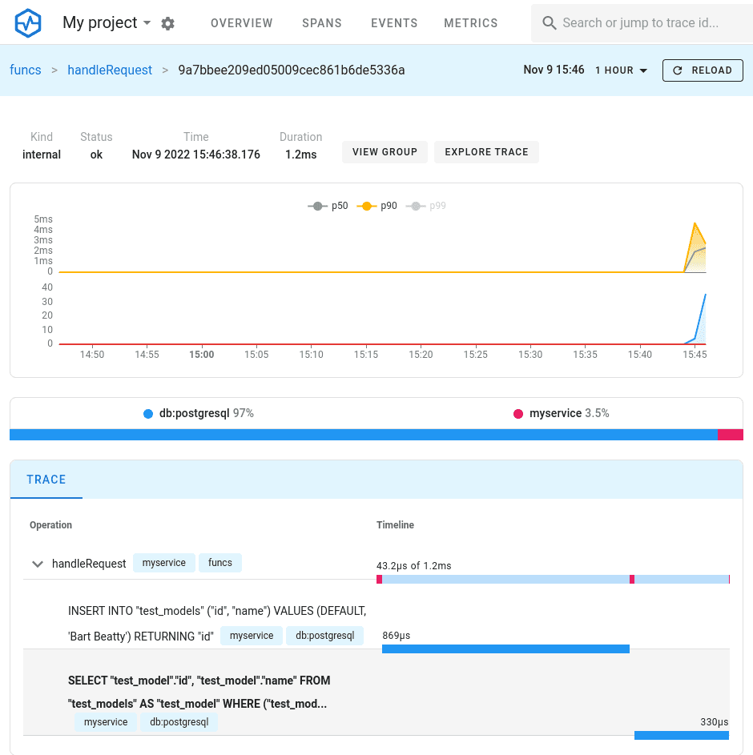

# Bun SQL Client OpenTelemetry Monitoring Example

A complete example demonstrating how to instrument and monitor Bun SQL client performance using
OpenTelemetry and [Uptrace](https://github.com/uptrace/uptrace). This setup provides real-time
observability into your database operations, including query performance, errors, and connection
metrics.

## 🚀 Features

- **SQL Query Monitoring**: Track query execution times, errors, and patterns
- **Database Performance Insights**: Identify slow queries and bottlenecks
- **Distributed Tracing**: Full request-to-database visibility
- **Real-time Metrics**: Connection pools, query counts, and error rates
- **Visual Dashboards**: Interactive UI for exploring traces and metrics

## 📋 Prerequisites

- [Docker](https://docs.docker.com/get-docker/) and Docker Compose
- [Go](https://golang.org/doc/install) (for running the example)
- Git

## 🛠️ Quick Start

### 1. Clone the Repository

```bash
git clone https://github.com/uptrace/bun.git
cd example/opentelemetry
```

### 2. Start Infrastructure Services

Launch PostgreSQL, ClickHouse, and Uptrace using Docker Compose:

```bash
docker compose pull
docker compose up -d
```

**Note**: Remove `sudo` if your user is in the `docker` group.

### 3. Verify Uptrace is Running

Check the Uptrace service logs to ensure it started successfully:

```bash
docker compose logs uptrace
```

You should see logs indicating Uptrace is ready and listening on port 14318.

### 4. Run the Example Application

Execute the Bun client example with OpenTelemetry instrumentation:

```bash
UPTRACE_DSN="http://project1_secret@localhost:14318?grpc=14317" go run client.go
```

The application will:

- Connect to PostgreSQL
- Execute sample SQL operations
- Send telemetry data to Uptrace
- Display a trace URL in the console

### 5. View the Results

The CLI will output a direct link to view the generated trace:

```
trace: http://localhost:14318/traces/ee029d8782242c8ed38b16d961093b35
```

Click the link or copy it to your browser to see the detailed trace visualization.



### 6. Explore the Uptrace Dashboard

Open the main Uptrace UI at [http://localhost:14318](http://localhost:14318) to explore:

- **Traces**: Detailed request flows and SQL operations
- **Metrics**: Database performance statistics
- **Logs**: Application and database logs
- **Service Map**: Visual representation of service dependencies

## 📊 What You'll See

The example demonstrates monitoring of common database operations:

- **Connection establishment** and pool management
- **Query execution** with timing and parameters
- **Transaction handling** and rollback scenarios
- **Error tracking** for failed operations
- **Batch operations** and prepared statements

## 🔧 Configuration

The example uses these key configuration values:

| Parameter   | Value                                               | Description                   |
| ----------- | --------------------------------------------------- | ----------------------------- |
| Uptrace DSN | `http://project1_secret@localhost:14318?grpc=14317` | Connection string for Uptrace |
| PostgreSQL  | `localhost:5432`                                    | Database server endpoint      |
| Uptrace UI  | `http://localhost:14318`                            | Web interface URL             |

## 🚀 Next Steps

- **Customize the example**: Modify `client.go` to test your specific use cases
- **Add more databases**: Extend monitoring to MySQL, SQLite, or other supported databases
- **Production setup**: Review the
  [production deployment guide](https://bun.uptrace.dev/guide/performance-monitoring.html#production)
- **Advanced features**: Explore custom metrics, alerts, and dashboards

## 🧹 Cleanup

To stop and remove all services:

```bash
docker compose down -v
```

This removes containers, networks, and volumes created by the example.

## 📚 Additional Resources

- **[Bun Performance Monitoring Guide](https://bun.uptrace.dev/guide/performance-monitoring.html)** -
  Comprehensive monitoring documentation
- **[Uptrace Documentation](https://uptrace.dev/get/hosted/open-source-apm)** - Open-source APM
  platform guide
- **[OpenTelemetry Go](https://uptrace.dev/get/opentelemetry-go/tracing)** - Go tracing
  instrumentation
- **[Bun ORM Documentation](https://bun.uptrace.dev/)** - Complete Bun usage guide

## 🤝 Contributing

Found an issue or want to improve this example? Please open an issue or submit a pull request on the
[Bun repository](https://github.com/uptrace/bun).

---

**⭐ Star the project** on GitHub if this example helped you!
